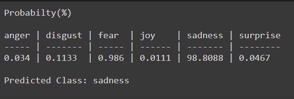

# TransEmoC: Emotion Classification Toolkit using Tranformers
This git repo is a part of the Project [Emotion Classification in a Resource Constrained Language](https://github.com/omar-sharif03/NAACL-SRW-2021).
The proposed model described in the corresponding [paper](https://arxiv.org/abs/2104.08613) is wrapped up in this git project for reuse by developers and researchers.
## Usage
1. Clone the github repository
```
git clone https://github.com/avishek-018/TransEmoC.git
```
2. Change directory
```
cd TransEmoC
```

   #### If you are using [colab](https://colab.research.google.com/) ignore steps above and proceed with the following code snippet
   ```
   !git clone https://github.com/avishek-018/TransEmoC.git
   !mv  -v TransEmoC/* /content
   !rm -rf TransEmoC
   ```

3. Install the requirements
```
pip install -r requirements.txt
```
4. Run train.py with you data and specify the hyperparameter(optional)
```
python train.py  --train <"path to train data(xlsx/csv)"> --val <"path to val data(xlsx/csv)"> --text_col <"text data column name"> --model <"model name"> --label_col  <"class/label column name"> --epochs <num of epochs> --batch_size <batch size> --lr <learning rate> --maxlen <max text length>
```
Required arguments:
<ul>
<li>--train </li>
<li>--val </li>
<li>--text_col </li>
<li>--label_col </li>
</ul>
 
And the optional arguments are (otherwise proposed hyperpameters are used)
<ul>
<li>--model </li>
<li>--epochs </li>
<li>--batch_size </li>
<li>--lr </li>
<li>--maxlen </li>
</ul>
Exmaple for this repository:

```
python train.py  --train "data/train.xlsx" --val "data/val.xlsx" --text_col "cleaned" --label_col "classes" --model "xlm-roberta-base" --epochs 20 --batch_size 12 --lr 2e-5 --maxlen 70
```
5. Run evaluate.py to evaluate your model with test data
```
python evaluate.py --test <"path to test data(xlsx/csv)"> --text_col <"text data column name"> --label_col "classes" --model <"/path/to/model"> 
```
Required arguments:
<ul>
<li>--test </li>
<li>--text_col </li>
<li>--label_col </li>
</ul>
 
And the optional arguments are (otherwise default model location used)
<ul>
<li>--model </li>
</ul>
Exmaple for this repository:

```
python evaluate.py --test "data/test.xlsx" --text_col "cleaned" --label_col "classes" --model "model" 
```

<b>Output</b>

A <i>result.txt</i> file is generated


6. Run predict.py to get the prediction for a text
```
python predict.py --sentence "your text goes here" --model <"/path/to/model"> 
```

Exmaple for this repository:
```
python predict.py --sentence "ছেলেটা তিন দিন ধরে না খেয়ে আছে" --model "model" 
```
Output:



## Cite this work
If you find this repository helpful in your work please cite the following
```
@inproceedings{das-etal-2021-emotion,
    title = "Emotion Classification in a Resource Constrained Language Using Transformer-based Approach",
    author = "Das, Avishek  and
      Sharif, Omar  and
      Hoque, Mohammed Moshiul  and
      Sarker, Iqbal H.",
    booktitle = "Proceedings of the 2021 Conference of the North American Chapter of the Association for Computational Linguistics: Student Research Workshop",
    month = jun,
    year = "2021",
    address = "Online",
    publisher = "Association for Computational Linguistics",
    url = "https://www.aclweb.org/anthology/2021.naacl-srw.19",
    pages = "150--158",
    abstract = "Although research on emotion classification has significantly progressed in high-resource languages, it is still infancy for resource-constrained languages like Bengali. However, unavailability of necessary language processing tools and deficiency of benchmark corpora makes the emotion classification task in Bengali more challenging and complicated. This work proposes a transformer-based technique to classify the Bengali text into one of the six basic emotions: anger, fear, disgust, sadness, joy, and surprise. A Bengali emotion corpus consists of 6243 texts is developed for the classification task. Experimentation carried out using various machine learning (LR, RF, MNB, SVM), deep neural networks (CNN, BiLSTM, CNN+BiLSTM) and transformer (Bangla-BERT, m-BERT, XLM-R) based approaches. Experimental outcomes indicate that XLM-R outdoes all other techniques by achieving the highest weighted f{\_}1-score of 69.73{\%} on the test data.",
}

```

## Note

If you find any anomaly or have any query/suggestion feel free to ping. Pull requests are welcome.
