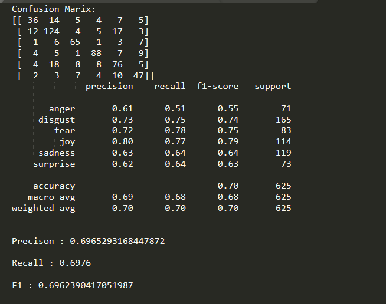

# Emotion Classification using Tranformers
This git repo is a part of the Project [Emotion Classification in a Resource Constrained Language](https://github.com/omar-sharif03/NAACL-SRW-2021).
The proposed model described in the corresponding [paper](https://arxiv.org/abs/2104.08613) is wrapped up in this git project for reuse by developers and researchers.
## Usage
1. Clone the github repository
```
git clone https://github.com/avishek-018/Emotion-Classification-using-Transformers.git
```
2. Change directory
```
cd emotion-classification-using-tranformers
```

   #### If you are using [colab](https://colab.research.google.com/) ignore steps above and proceed with the following code snippet
   ```
   !git clone https://github.com/avishek-018/Emotion-Classification-using-Transformers.git
   !mv  -v emotion-classification-using-tranformers/* /content
   !rm -rf emotion-classification-using-tranformers
   ```

3. Install the requirements
```
pip install -r requirements.txt
```
4. Run train.py with you data and specify the hyperparameter(optional)
```
python train.py  --train <"path to train data(xlsx/csv)"> --val <"path to val data(xlsx/csv)"> --text_col <"text data column name"> --label_col  <"class/label column name"> --epochs <num of epochs> --batch_size <batch size> --lr <learning rate> --maxlen <max text length>
```
Required arguments:
<ul>
<li>--train </li>
<li>--val </li>
<li>--text_col </li>
<li>--label_col </li>
</ul>
 
And the optional arguments are (otherwise proposed hyperpameters are used)
<ul>
<li>--epochs </li>
<li>--batch_size </li>
<li>--lr </li>
<li>--maxlen </li>
</ul>
Exmaple for this repository:

```
python train.py  --train "data/train.xlsx" --val <"path to text data(xlsx/csv)"> --text_col "cleaned" --label_col "classes" --epochs 20 --batch_size 12 --lr 2e-5 --maxlen 70
```
5. Run evaluate.py to evaluate your model with test data
```
python evaluate.py --test "data/test.xlsx" --text_col <"text data column name"> --label_col "classes" --model <"/path/to/model"> 
```
Required arguments:
<ul>
<li>--test </li>
<li>--text_col </li>
<li>--label_col </li>
</ul>
 
And the optional arguments are (otherwise default model location used)
<ul>
<li>--model </li>
</ul>
Exmaple for this repository:

```
python evaluate.py --test "data/test.xlsx" --text_col "cleaned" --label_col <"class/label column name"> --model "model" 
```

<b>Output</b>

A <i>result.txt</i> file is generated



## Cite this work
If you find this repository helpful in your work please cite the following
```
@article{das2021emotion,
  title={Emotion Classification in a Resource Constrained Language Using Transformer-based Approach},
  author={Das, Avishek and Sharif, Omar and Hoque, Mohammed Moshiul and Sarker, Iqbal H},
  journal={arXiv preprint arXiv:2104.08613},
  year={2021}
}
```

## Note

If you find any anomaly or have any query/suggestion feel free to ping. Pull requests are welcome.
